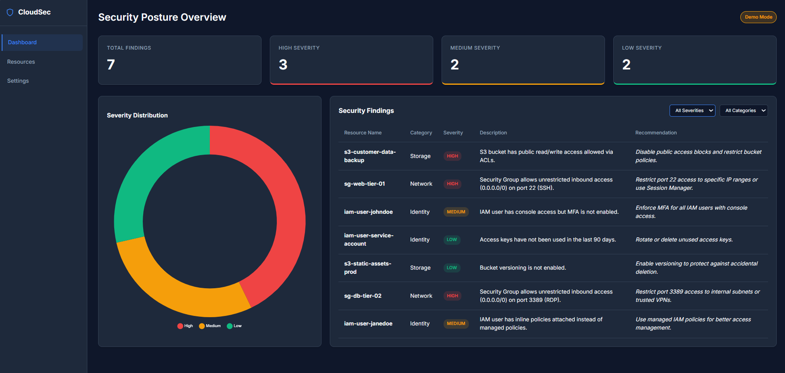
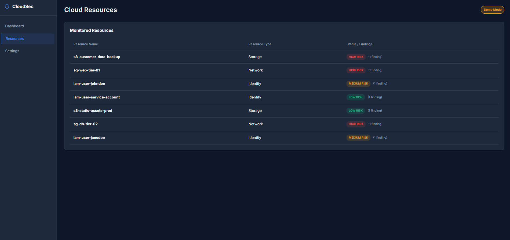
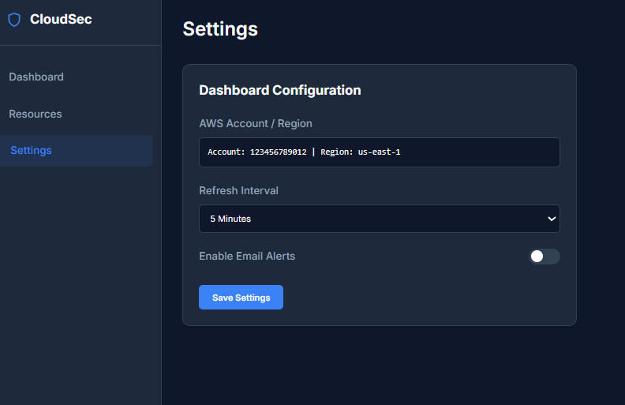

# Cloud Security Posture Dashboard

## Overview
The Cloud Security Posture Dashboard is a sleek, real-time web application designed to visualize AWS cloud security findings and monitor your cloud environment's security posture. Built as a portfolio project, it provides an intuitive interface to aggregate, filter, and analyze security issues across your cloud resources. It prioritizes live AWS data via `boto3` and seamlessly falls back to a local JSON dataset if no active AWS session is available.

## Features
- **Live AWS Integration**: Fetches real cloud security findings using AWS SDK (`boto3`) when credentials are provided.
- **Offline/Demo Mode**: Automatically falls back to a sample JSON dataset, allowing the dashboard to run anywhere without AWS access.
- **Dynamic Security Dashboard**: Displays key security metrics including total findings and severity counts (High, Medium, Low).
- **Visual Analytics**: Features an interactive doughnut chart powered by Chart.js to visualize the distribution of severity levels.
- **Advanced Filtering & Data Tables**: Allows users to dynamically sort and filter detailed security findings by category and severity.
- **Cloud Resources View**: Dynamically lists unique cloud resources and aggregates their specific security risks.
- **Settings Configuration**: A user-friendly settings interface for toggling notification preferences and refresh intervals (UI Demo).
- **Responsive Dark-Theme UI**: A modern, premium dark-mode interface designed with pure HTML, CSS, and JS.

## Tech Stack
- **Backend**: Python, Flask, boto3 (AWS SDK for Python)
- **Frontend**: HTML5, Vanilla CSS3 (Custom Dark Theme), Vanilla JavaScript
- **Data Visualization**: Chart.js

## Screenshots

Dashboard

*The main dashboard view showing summary cards, severity distribution, and findings.*

Resouces

*Cloud Resources view dynamically listing monitored infrastructure and associated risks.*

Settings

*Settings configuration for AWS account details, refresh intervals, and email alerts.*

## Installation

1. Clone the repository:
   ```bash
   git clone <repo-url>
   ```
2. Navigate into the project directory and create a virtual environment:
   ```bash
   python -m venv venv
   
   # Activate it on Windows:
   venv\Scripts\activate
   
   # Activate it on macOS/Linux:
   source venv/bin/activate
   ```
3. Install the required dependencies:
   ```bash
   pip install -r requirements.txt
   ```
4. (Optional) Configure your AWS credentials to fetch live data:
   ```bash
   aws configure
   ```
   *If you skip this step, the app will automatically run in Demo Mode using sample data.*
5. Run the Flask backend server:
   ```bash
   python backend/app.py
   ```
6. Open your web browser and navigate to `http://localhost:5000`. The Flask application will automatically serve the frontend dashboard.
